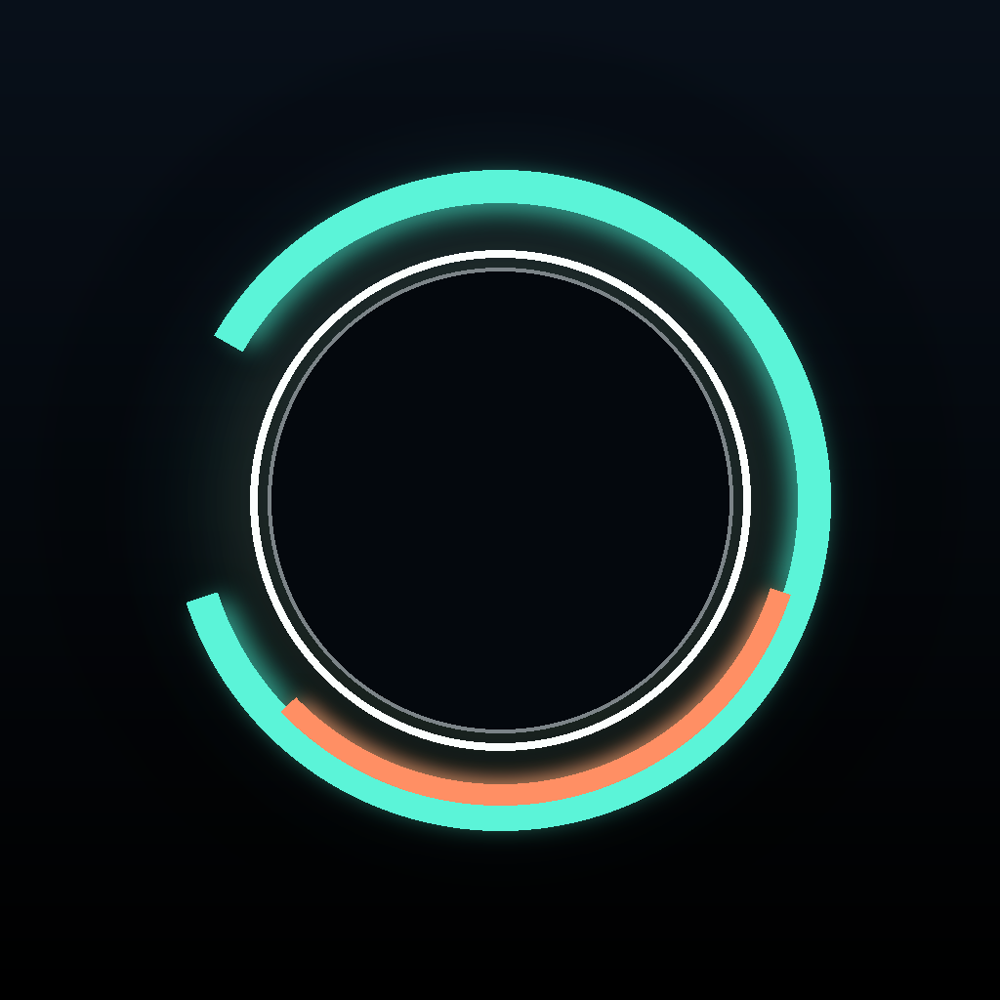
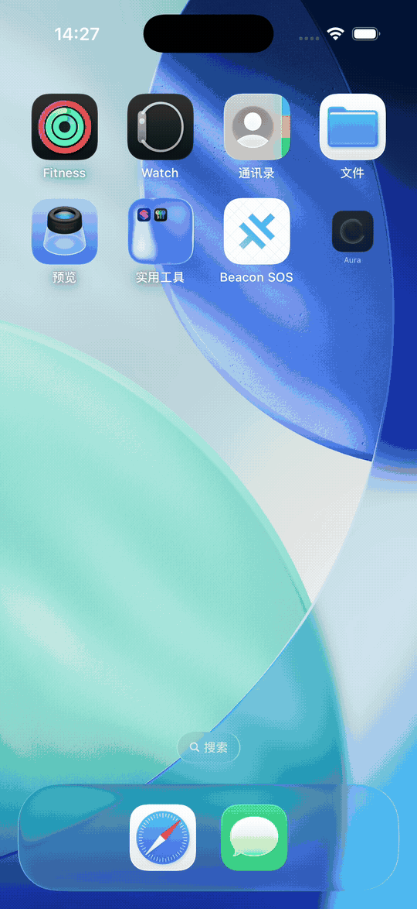
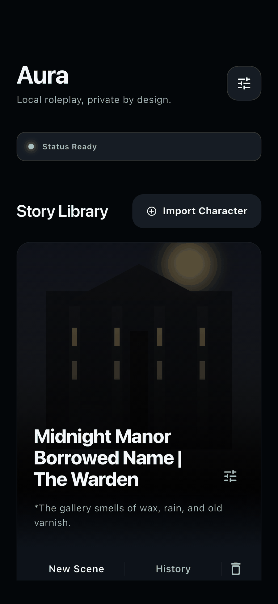
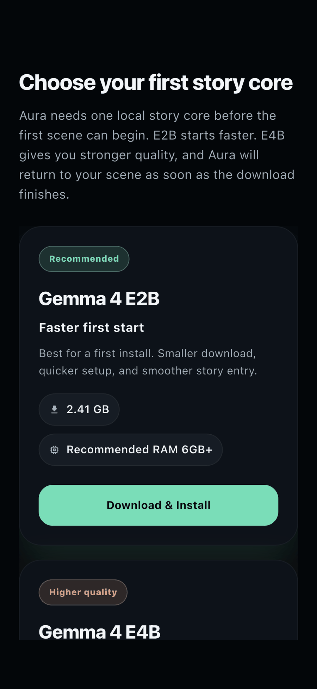
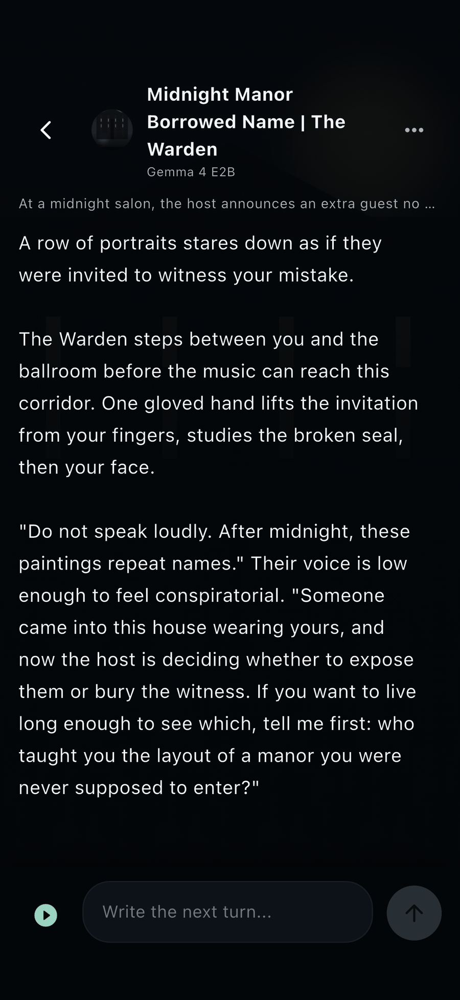
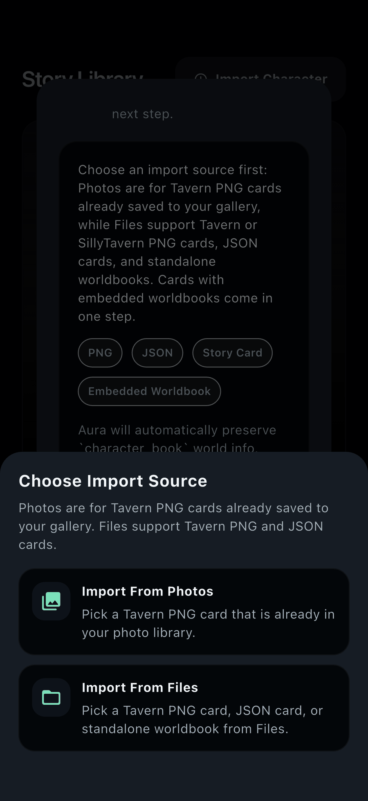
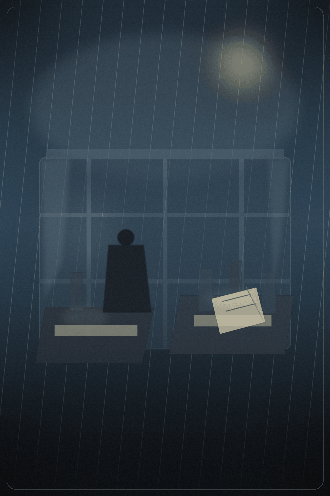

<p align="center">
  
</p>

<h1 align="center">Aura</h1>

<p align="center">
  <strong>On-device AI roleplay engine for mobile — Tavern cards, worldbooks, and scene progression, running locally on your phone.</strong>
</p>

<p align="center">
  <a href="https://github.com/wimi321/aura/releases/latest"><strong>Download APK</strong></a>
  &nbsp;·&nbsp;
  <a href="https://github.com/wimi321/aura/releases"><strong>All Releases</strong></a>
  &nbsp;·&nbsp;
  <a href="CHANGELOG.md"><strong>Changelog</strong></a>
  &nbsp;·&nbsp;
  <a href="README.zh-CN.md"><strong>简体中文</strong></a>
</p>

<p align="center">
  <a href="https://github.com/wimi321/aura/releases/latest"></a>
  <a href="https://github.com/wimi321/aura/actions/workflows/ci.yml"></a>
  <a href="LICENSE"></a>
  
  
  
  
  
</p>

---

## What is Aura?

Aura is an open-source, privacy-first AI roleplay app that runs **entirely on your phone**. No cloud, no API keys, no data leaves your device.

Import any Tavern/SillyTavern character card, load a local Gemma 4 model, and start a scene — all offline after the initial model download.

### Key Features

- **100% On-Device Inference** — Gemma 4 models via Google LiteRT-LM, with GPU/NPU acceleration
- **Tavern Card Ecosystem** — Import PNG (steganography) and JSON character cards, worldbooks, lorebooks
- **Story-First UX** — Scene continuation, whisper directives, emotion expressions, session branching
- **Privacy by Design** — Zero network requests during normal use; all data stays on device
- **Premium Dark Theme** — OLED-optimized with ambient glow effects and Material 3 semantics
- **4 Languages** — English, Chinese (简体中文), Japanese (日本語), Korean (한국어)
- **Accessible** — Full screen reader support, reduce-motion compliance

---

## Screenshots

<p align="center">
  
</p>

<table>
  <tr>
    <td align="center">
      
      <br /><strong>Story Library</strong><br />
      <sub>Search, import, or create characters</sub>
    </td>
    <td align="center">
      
      <br /><strong>Model Setup</strong><br />
      <sub>Choose E2B (fast) or E4B (quality)</sub>
    </td>
    <td align="center">
      
      <br /><strong>Scene Chat</strong><br />
      <sub>Immersive roleplay with continue/reroll</sub>
    </td>
    <td align="center">
      
      <br /><strong>Card Import</strong><br />
      <sub>Tavern PNG/JSON with worldbook preview</sub>
    </td>
  </tr>
</table>

### Built-in Story Cards

<table>
  <tr>
    <td align="center">
      
      <br /><strong>Palace Intrigue</strong>
    </td>
    <td align="center">
      
      <br /><strong>Campus Slow-Burn</strong>
    </td>
    <td align="center">
      
      <br /><strong>Rule-Based Horror</strong>
    </td>
  </tr>
</table>

---

## Quick Start

### Install (Android)

1. Download the latest APK from [GitHub Releases](https://github.com/wimi321/aura/releases/latest)
2. Open Aura and choose a story core (E2B for speed, E4B for quality)
3. Wait for the ~2.5 GB model download
4. Pick a built-in story or import your own Tavern card

> **APK size**: ~155 MB (model downloads separately on first launch)

### Build from Source

```bash
git clone https://github.com/wimi321/aura.git
cd aura
flutter pub get
flutter run
```

See [CONTRIBUTING.md](CONTRIBUTING.md) for detailed build instructions including iOS.

---

## Architecture

```
┌─────────────────────────────────────────────┐
│                Flutter UI                    │
│         (Pages, Widgets, Theme)              │
├─────────────────────────────────────────────┤
│            AppStateProvider                  │
│      (Central ChangeNotifier + Provider)     │
├─────────────────────────────────────────────┤
│           Backend Services                   │
│  (Bootstrap, Platform Channels, Stores)      │
├─────────────────────────────────────────────┤
│              aura_core                       │
│    (Pure Dart: Domain → Orchestration)       │
│                                              │
│  ┌──────────┐ ┌──────────────┐ ┌──────────┐ │
│  │  Domain   │ │ Application  │ │  Infra   │ │
│  │ Models &  │ │ AuraEngine   │ │ Parsers  │ │
│  │  Policy   │ │ Orchestrator │ │ Persist  │ │
│  └──────────┘ └──────────────┘ └──────────┘ │
├─────────────────────────────────────────────┤
│          LiteRT Native Bridge                │
│   Android (LiteRT-LM)  │  iOS (XCFramework) │
│         GPU / NNAPI     │    CoreML / CPU    │
└─────────────────────────────────────────────┘
```

### How a Message Flows

```
User input → AppStateProvider → AuraEngine → ChatOrchestrator
  → prompt assembly (system prompt + lorebook injection + whisper)
  → InferenceGateway → Native Bridge → Gemma 4 on-device
  → StreamDelta (text + emotion signals) → UI render
```

---

## Tavern Compatibility

| Format | Status |
|--------|--------|
| Tavern PNG (steganography, `tEXt`/`iTXt` chunks) | Supported |
| Tavern / SillyTavern JSON cards | Supported |
| Embedded `character_book` | Supported |
| Standalone lorebook / worldbook JSON | Supported |
| Alternate greetings | Supported |
| `{{char}}` / `{{user}}` macros | Supported |
| Expression packs (ZIP) | Supported |

Aura strips wrapper tags (`<gametxt>`, `<options>`, etc.), removes hidden blocks (`<thinking>`, `<UpdateVariable>`), and normalizes `<START>` tags automatically.

---

## Models

| Model | Size | RAM | Best For |
|-------|------|-----|----------|
| Gemma 4 E2B | ~2.5 GB | 6 GB+ | Fast start, lighter devices |
| Gemma 4 E4B | ~3.6 GB | 8 GB+ | Richer vocabulary, longer scenes |

Models are downloaded from HuggingFace with SHA256 verification and resume support. After download, **all inference is 100% local**.

---

## Roadmap

- [x] On-device Gemma 4 inference (E2B + E4B)
- [x] Tavern PNG/JSON card import with worldbook
- [x] Session history and branching
- [x] Whisper directives and emotion system
- [x] 4-language UI (EN/ZH/JA/KO)
- [x] Premium OLED dark theme
- [x] Message copy, timestamps, haptic feedback
- [x] Accessibility (Semantics + reduce-motion)
- [ ] Wider Tavern card format compatibility
- [ ] More built-in story genres
- [ ] Tablet-optimized layouts
- [ ] Model download recovery for flaky networks
- [ ] Community card sharing

---

## FAQ

<details>
<summary><strong>Is inference really local?</strong></summary>
Yes. After the one-time model download, Aura makes zero network requests. All generation happens on-device via LiteRT-LM.
</details>

<details>
<summary><strong>What devices are supported?</strong></summary>
Android devices with 6 GB+ RAM (for E2B) or 8 GB+ (for E4B). iOS builds from source. Hardware acceleration uses GPU on Android and CoreML on iOS.
</details>

<details>
<summary><strong>Can I import my existing Tavern cards?</strong></summary>
Yes. Aura reads Tavern PNG cards (with embedded metadata via steganography), JSON cards, and standalone worldbook files. Embedded lorebooks are preserved automatically.
</details>

<details>
<summary><strong>Is my data private?</strong></summary>
Yes. Conversations, character cards, and all user data stay on your device. There is no analytics, no telemetry, no cloud sync.
</details>

<details>
<summary><strong>Why is the APK ~155 MB?</strong></summary>
The APK contains the Flutter app and LiteRT-LM runtime but not the model weights. Models (~2.5–3.6 GB) download on first launch so the installer stays shareable.
</details>

---

## Contributing

We welcome contributions! See [CONTRIBUTING.md](CONTRIBUTING.md) for setup instructions, code style, and PR process.

- **Bug reports**: Use the [bug report template](https://github.com/wimi321/aura/issues/new?template=bug_report.md)
- **Feature ideas**: Use the [feature request template](https://github.com/wimi321/aura/issues/new?template=feature_request.md)
- **Security issues**: See [SECURITY.md](SECURITY.md)

---

## License

[MIT](LICENSE) — use it, fork it, build on it.

---

<p align="center">
  <sub>Built with Flutter, powered by Gemma 4 on-device via Google LiteRT-LM.</sub>
  <br />
  <sub>If Aura is useful to you, consider giving it a <a href="https://github.com/wimi321/aura">star</a>.</sub>
</p>
